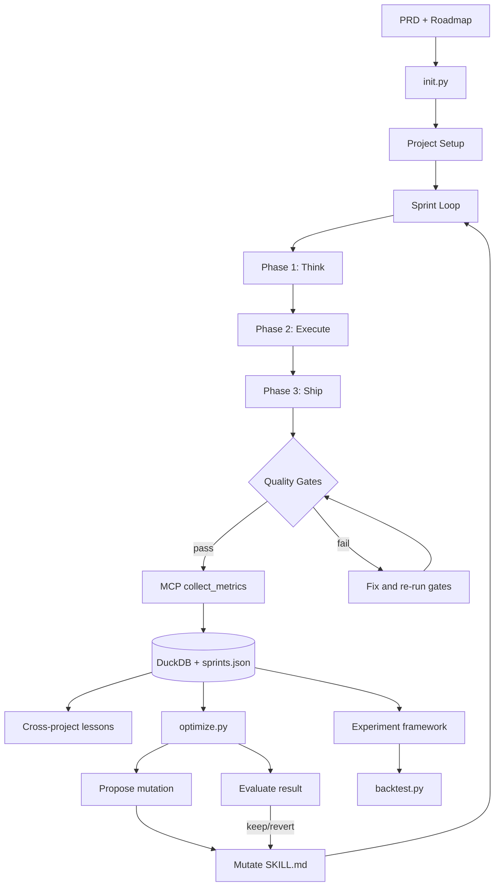

# Flowstate

I built a system that ran 130+ autonomous AI agent sprints across 16 projects, then designed and ran controlled experiments to test whether it could optimize itself.

## What Flowstate Is

Flowstate is a sprint-based development workflow for [Claude Code](https://docs.anthropic.com/en/docs/claude-code). Each sprint follows a three-phase cycle (Think, Execute, Ship) with automated quality gates that enforce test passage, coverage baselines, and clean builds. A metrics pipeline collects token usage, session time, and code output per sprint into a DuckDB-backed SQL analytics layer with queryable schemas and a dashboard serving per-sprint metrics across 130+ sprints and 16 projects. On top of that data sits a cross-project lesson extractor (229 lessons ranked by Bayesian confidence), a gate failure classifier (66 failures across 43 lint, 20 test, 3 coverage), and a hill-climbing optimizer that proposes process mutations, waits for real sprint data, then keeps or reverts changes based on measured outcomes.

## Architecture



## What the Experiments Found

Flowstate includes a controlled experiment framework for testing whether workflow mutations actually improve outcomes. Two experiments have been run. Full design and results are in [`experiment/README.md`](experiment/README.md).

**v1.2: 2x2 Factorial** -- 2 features (lint pre-check, cross-project lessons) x 2 levels, 5 products completed, 34 builds total including replicates. Matched-pair design to control for product difficulty.

| Main effect | Token efficiency delta (tok/LOC) | Signal vs. noise |
|-------------|----------------------------------|-------------------|
| Lint pre-check | +9.7 (worse) | Outside noise floor -- net negative |
| Cross-project lessons | -3.3 (better) | Inside 10-13% noise floor -- inconclusive |
| Lint x Lessons interaction | +18.0 (worse) | Interference, not synergy |

The noise floor from LLM stochasticity (10-13% between identical replicates) makes small effects hard to isolate in short-lived experiment builds. Lint pre-check was dropped (measurably net negative). Cross-project lessons and the other v1.2 mutations (gate failure memory, coverage floor, model routing) remain active across real projects -- the experiment couldn't confirm they help at small N, but it also couldn't rule out compounding benefits over longer timescales. Real projects running 15-20+ sprints are the actual test bed.

**v1.3: Codebase Map Injection** -- Matched-pair, 2 products (notegrep TS, pollster Python), 10 sprints each, control vs. structural context injection.

| Product | Efficiency delta | Learning curve difference |
|---------|-----------------|--------------------------|
| notegrep | -2.4% (noise) | No difference |
| pollster | +8.0% (map worse) | No difference |

Codebase map injection showed no benefit -- the agent orients itself well enough without a pre-built map. Not shipped.

## Key Numbers

- **130+ sprints** across **16 projects** (Swift, TypeScript, Go, Rust, Python, SvelteKit, Docker/Bash)
- **229 cross-project lessons** extracted and ranked by Bayesian confidence
- **66 classified gate failures** (43 lint, 20 test, 3 coverage)
- **34 experiment builds** in v1.2 factorial + **4 builds** (10 sprints each) in v1.3

## Repo Structure

```
skills/              Planning skills (PM, UX, Architect, Prod Eng, Security)
tier-1/              Sprint template + config for standard environments
tier-2/              Sprint template for restricted environments
tier-3/              Minimal sprint template
tools/
  import_sprint.py   Import sprint metrics into sprints.json and DuckDB
  mcp_server.py      MCP server for collecting metrics from session logs
  optimize.py        Hill-climbing optimizer (propose/evaluate/status)
  backtest.py        Backtest mutations against historical sprint data
  init.py            Bootstrap script for new projects
experiment/
  PROTOCOL.md        v1.2 factorial experiment design
  CODEBASE-MAP.md    v1.3 codebase map experiment design
  README.md          Experiment results summary
  conditions/        SKILL.md variants for each experimental condition
  prds/              Product PRDs used in experiments
sprints.json         Sprint metrics (backward-compatible flat file)
dashboard/           Optional static dashboard for visualizing sprint data
PRD.md               Workflow reference
```

<details>
<summary><strong>Setup</strong></summary>

### 1. Clone and set up your project workspace

```bash
git clone https://github.com/smledbetter/flowstate.git

mkdir -p ~/.flowstate/my-project/metrics
mkdir -p ~/.flowstate/my-project/retrospectives
```

### 2. Copy planning skills into your project

```bash
cp flowstate/skills/product-manager.md your-project/.claude/skills/
cp flowstate/skills/ux-designer.md your-project/.claude/skills/
cp flowstate/skills/architect.md your-project/.claude/skills/
```

### 3. Configure your gates

Create `~/.flowstate/my-project/flowstate.config.md`:

```markdown
## Quality Gates
- test_command: npm test
- type_check: npx tsc --noEmit
- lint: npx eslint .
- coverage_command: npm test -- --coverage
- coverage_threshold: 65
```

### 4. Write a baseline and run your first sprint

Record your starting state (SHA, test count, coverage), then paste the sprint prompt from `tier-1/sprint.md` into a fresh Claude Code session.

See [PRD.md](PRD.md) for the full workflow reference.

### Collecting Metrics

**Option A: MCP server** (recommended)

The MCP server at `tools/mcp_server.py` reads Claude Code session logs directly. At the end of a sprint, run `/import` to collect and import metrics automatically.

**Option B: Shell script**

Run `tier-1/collect.sh` from your project directory. It auto-detects the project and writes the import JSON.

Either way, import with:

```bash
python3 tools/import_sprint.py --from ~/.flowstate/my-project/metrics/sprint-1-import.json
```

</details>
